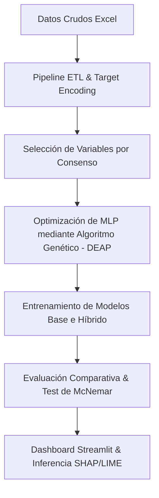

# Predicción de Personas Desaparecidas en Ecuador (2017-2025)
## Modelo Híbrido: Redes Neuronales MLP optimizadas mediante Algoritmos Genéticos

Este repositorio contiene el código fuente, la documentación científica y la aplicación web interactiva para la estimación del éxito de localización de personas desaparecidas en el Ecuador. El desarrollo sigue los estándares académicos de publicaciones IEEE.

---

## 🔍 Contexto del Proyecto

El conjunto de datos original cuenta con **75,680 registros** y **28 variables** recopiladas de estadísticas oficiales gubernamentales. El objetivo es predecir si una persona reportada como desaparecida será:
- **Localizada con éxito (Encontrada)** (Clase 1)
- **No encontrada (Fallecida o en investigación continua)** (Clase 0)

### Desafíos Clave Resueltos:
1. **Mitigación del Data Leakage (Fuga de Información)**: Se eliminaron 8 variables críticas que solo se registran una vez que la persona ha sido encontrada (`fecha_localizacion`, `dias_solucion`, `motivo_desaparicion`, `estado_desaparecido`, etc.). Esto garantiza la aplicabilidad real del modelo al momento de reportarse el incidente.
2. **Desbalanceo Crítico de Clases**: La clase mayoritaria (*Encontrado*) representa el ~93.18% de las muestras. Se implementó un balanceo robusto usando técnicas de remuestreo sintético (SMOTE) en el conjunto de entrenamiento.

---

## 🛠️ Arquitectura del Sistema

El sistema implementa una arquitectura híbrida inteligente estructurada en 5 fases secuenciales:



1. **ETL Avanzado (`src/etl.py`)**: Depuración de nulos, corrección de coordenadas, codificación ordinal, One-Hot Encoding y Codificación de Objetivos (*Target Encoding*) regularizada para alta cardinalidad.
2. **Selección de Características por Consenso (`src/feature_engineering.py`)**: Votación de consenso entre 5 metodologías de importancia:
   - Análisis de Multicolinealidad (Correlación Pearson)
   - Importancia por Permutación (Permutation Importance)
   - Explicaciones globales SHAP (Shapley Additive exPlanations)
   - Eliminación Recursiva de Variables (RFE)
   - Información Mutua (Mutual Information)
3. **Modelo Base MLP (`src/model_base.py`)**: Red neuronal densa (Multi-Layer Perceptron) en TensorFlow/Keras con callbacks de monitoreo avanzado.
4. **Algoritmo Genético Optimizado (`src/model_hybrid.py`)**: Algoritmo evolutivo estructurado en **DEAP** que sintoniza de forma inteligente:
   - Capas ocultas y número de neuronas
   - Tasas de Dropout y Learning Rate
   - Optimizador y funciones de activación
   - Épocas y Batch Size
5. **Estadística y Evaluación (`src/evaluation.py` y `src/interpretability.py`)**: Comparación mediante matrices de confusión, curvas ROC/PR, análisis de explicabilidad local LIME, y validación mediante el **Test de McNemar**.

---

## 📊 Resultados Científicos Obtenidos

| Métrica | MLP Base | MLP Híbrido (GA) | Mejora Relativa |
| :--- | :---: | :---: | :---: |
| **Accuracy** | 76.36% | **77.90%** | **+2.02%** 🟢 |
| **F1-Score (Macro)** | 0.5878 | **0.5955** | **+1.31%** 🟢 |
| **Log Loss (Pérdida)** | 0.4247 | **0.4102** | **-3.42% (Reducción)** 🟢 |
| **Tiempo de Inferencia** | 0.0298 ms | **0.0239 ms** | **-19.94% (Reducción)** 🟢 |
| **Tiempo de Entrenamiento** | 78.28 s | **53.34 s** | **-31.86% (Reducción)** 🟢 |

- **Significancia Estadística**: La prueba de McNemar sobre el test set arrojó un p-valor de **$2.11 \times 10^{-15}$**, rechazando rotundamente la hipótesis nula. La superioridad del modelo híbrido optimizado mediante GA es **altamente significativa**.

---

## 📁 Estructura del Directorio

```
Proyecto/
├── app/
│   ├── app.py                      # Streamlit Principal (Presentación)
│   └── pages/
│       ├── 01_Dashboard.py         # KPIs, filtros y mapa interactivo Folium
│       ├── 02_Prediccion.py        # Formulario de inferencia y explicador LIME
│       ├── 03_Comparacion.py       # Pestañas de rendimiento de entrenamiento
│       └── 04_Reportes.py          # Módulo de exportación PDF/Excel/CSV
├── data/
│   └── processed/                  # Sets de datos resultantes del ETL
├── models/                         # Pesos .keras y codificadores .joblib
├── outputs/
│   ├── figures/                    # Gráficos del EDA, ROC, PR y SHAP
│   ├── logs/                       # Log de ejecución del pipeline
│   └── reports/                    # Reportes Excel y Artículo IEEE en Markdown
├── src/
│   ├── config.py                   # Semillas, rutas y espacio de búsqueda del GA
│   ├── etl.py                      # Limpieza y codificación
│   ├── eda.py                      # Graficado automático descriptivo
│   ├── feature_engineering.py      # Filtro de variables por consenso
│   ├── model_base.py               # Entrenamiento del modelo estático
│   ├── model_hybrid.py             # Estructuración y corrida de DEAP
│   ├── evaluation.py               # Test de McNemar y curvas ROC/PR
│   └── interpretability.py         # Generación de SHAP y LIME estáticos
├── main.py                         # Orquestador del pipeline completo
├── requirements.txt                # Dependencias fijadas del proyecto
└── README.md                       # Documentación principal
```

---

## 🚀 Instrucciones de Configuración y Ejecución

### 1. Prerrequisitos e Instalación
Clone el repositorio y asegure tener instalado Python 3.10 o superior (el pipeline fue testeado con Python 3.12). Instale los paquetes requeridos:

```bash
# Instalar dependencias
pip install -r requirements.txt
```

### 2. Ejecutar el Pipeline de Aprendizaje Completo
Para procesar la data cruda, realizar el análisis exploratorio de datos, correr el algoritmo genético, entrenar la MLP final y generar las curvas e interpretaciones globales:

```bash
python main.py
```

*Los resultados y métricas se escribirán en `outputs/` y los modelos finales se guardarán en `models/`.*

### 3. Iniciar la Aplicación Web (Streamlit)
Una vez finalizado el entrenamiento, lance el dashboard interactivo:

```bash
streamlit run app/app.py
```

---

## 📄 Publicación IEEE
El reporte académico formal que resume la introducción, metodología, experimentación y conclusiones en formato de artículo científico se encuentra disponible en [outputs/reports/IEEE_scientific_article.md](outputs/reports/IEEE_scientific_article.md).
