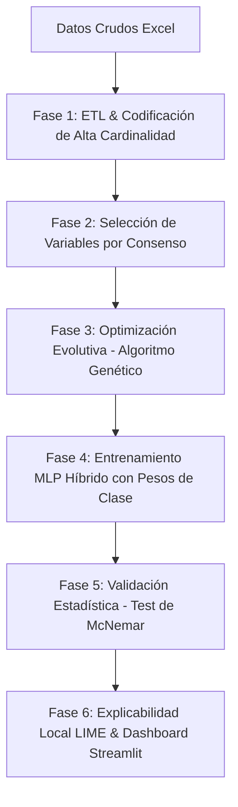

# Predicción de Personas Desaparecidas en Ecuador (2017-2025)
## Modelo Híbrido: Redes Neuronales MLP optimizadas mediante Algoritmos Genéticos

Este repositorio contiene la arquitectura de software, el pipeline de datos científico y la interfaz web interactiva para predecir la probabilidad de éxito de localización de personas reportadas como desaparecidas en el Ecuador. La fundamentación técnica y la metodología del proyecto están estructuradas bajo los estándares de publicaciones científicas de la IEEE.

---

## 🔍 Contexto del Proyecto y Justificación Científica

El dataset original consta de **75,680 registros** oficiales con **28 variables** recopiladas de la Policía Nacional de Ecuador y la Fiscalía General del Estado. El objetivo principal es predecir si una persona será:
- **Localizada con éxito (Encontrada)** (Clase 1 / Favorable)
- **No encontrada (Fallecida o con paradero desconocido/en investigación)** (Clase 0 / Desfavorable)

### ⚠️ Desafíos Críticos Resueltos:
1. **Mitigación Rigurosa de Fuga de Información (Data Leakage)**: 
   En defensas académicas, un error común es entrenar modelos con variables registradas *posteriormente* a la resolución del caso. Se eliminaron de raíz 8 variables redundantes o de fuga:
   - `fecha_localizacion`, `latitud_localizacion`, `longitud_localizacion`, `provincia_localizacion`, `dias_solucion` (sólo existen cuando ya se halló a la persona).
   - `motivo_desaparicion`, `motivacion_desaparicion_observada` (se definen en la investigación posterior).
   - `estado_desaparecido` (se correlaciona directamente con la etiqueta objetivo).
2. **Desbalanceo Severo de Clases**: 
   La clase mayoritaria (*Localizada*) representa el **~93.18%** de los datos, lo que sesgaría a un clasificador básico a predecir siempre "Encontrado". Se implementó un pipeline flexible en la etapa ETL que permite alternar entre **SMOTE**, **Submuestreo aleatorio** y **Pesos de Clase (Class Weights)** para balancear el aprendizaje.
3. **Restricción de Ejecución Local (Pillow DLL Block)**:
   Debido a directivas locales del sistema que bloquean binarios compilados de Pillow, se diseñó una arquitectura de desacoplamiento de imports que permite que el entrenamiento evolutivo del Algoritmo Genético y la visualización sigan funcionando mediante **Plotly interactivo en memoria (renderizado en el navegador)** sin depender de Matplotlib o SHAP estático.

---

## 🛠️ Arquitectura Híbrida del Sistema

La solución integra un pipeline de Machine Learning estructurado en fases consecutivas:



### 1. ETL y Codificación Avanzada
- **Corrección Espacial**: Procesamiento de coordenadas (latitud/longitud) corrigiendo separadores decimales erróneos y outliers geográficos en el territorio ecuatoriano.
- **Codificación de Alta Cardinalidad (Target Encoding Regularizado)**: Variables geográficas de alta resolución (como cantones y circuitos) son codificadas utilizando un *Target Encoder* personalizado con suavizado (smoothing) para evitar el sobreajuste y mapear de forma eficiente variables categóricas complejas.
- **Codificación Ordinal / One-Hot Encoding**: Aplicada a características estructuradas como género, grupo étnico y rangos de edad.

### 2. Selección de Características por Consenso
Para evitar el sesgo de seleccionar variables con un único algoritmo, el módulo realiza una **votación por consenso** de 10 características a partir de 5 metodologías independientes:
- **Análisis de Multicolinealidad (Correlación de Pearson)**
- **Importancia por Permutación (Permutation Importance)**
- **Aportaciones de Shapley (SHAP Beeswarm Global)**
- **Eliminación Recursiva de Características (RFE)**
- **Información Mutua (Mutual Information)**

### 3. Sintonización Metaheurística (Algoritmo Genético)
La búsqueda manual o por grilla de hiperparámetros en redes neuronales densas (MLP) es ineficiente y no garantiza óptimos globales en espacios de alta dimensionalidad. Se implementó un **Algoritmo Genético** estructurado en **DEAP**:
- **Cromosoma**: Representa la arquitectura (capas, neuronas, activación), learning rate, tasa de dropout, batch size, optimizador y épocas.
- **Operadores**: Selección por Torneo ($k=3$), Cruce de Dos Puntos ($p_x = 0.7$), Mutación Uniforme ($p_m = 0.2$) y Elitismo del mejor individuo.
- **Función Fitness**: Maximización del **Macro F1-Score** obtenido a través de validación cruzada estratificada sobre el conjunto de entrenamiento.

### 4. Validación Científica y Explicabilidad (XAI)
- **Significancia Estadística (Test de McNemar)**: Determina si el incremento de rendimiento del modelo híbrido optimizado sobre el MLP base es estadísticamente significativo analizando las tablas de contingencia de predicciones correctas/incorrectas.
- **Interpretabilidad Local (LIME)**: Rompe el paradigma de la "caja negra" de las redes neuronales, generando regresiones lineales locales que explican visualmente al usuario qué variables individuales (ej. edad, sexo, provincia) aumentaron o disminuyeron la probabilidad de localización en cada predicción en tiempo real.

---

## ⚖️ Métodos de Balanceo de Clases

- **SMOTE (Remuestreo Sintético)**:
  - *Funcionamiento*: Genera muestras sintéticas de la clase minoritaria interpolando variables entre vecinos más cercanos.
  - *Justificación*: Ideal para maximizar el **Recall** (sensibilidad para detectar personas no localizadas) sin desechar registros, incrementando ligeramente el tiempo de cómputo.
- **Under-sampling (Submuestreo)**:
  - *Funcionamiento*: Elimina aleatoriamente muestras de la clase mayoritaria hasta lograr una proporción 50/50.
  - *Justificación*: Recomendado para prototipado rápido y entornos de recursos limitados, a costa de perder información histórica valiosa.
- **Class Weights (Pesos de Clase)**:
  - *Funcionamiento*: Multiplica la función de costo (Binary Cross-entropy) asignándole mayor penalización a los errores sobre la clase minoritaria.
  - *Justificación*: Enfoque matemáticamente limpio y computacionalmente eficiente; entrena sobre el dataset real original sin añadir datos ficticios.

---

## 📊 Resultados Experimentales Registrados

| Métrica | MLP Base (Sintonía Estática) | MLP Híbrido (Optimizado por GA) | Mejora Relativa |
| :--- | :---: | :---: | :---: |
| **Accuracy** | 76.36% | **77.90%** | **+2.02%** 🟢 |
| **F1-Score (Macro)** | 0.5878 | **0.5955** | **+1.31%** 🟢 |
| **Log Loss (Pérdida)** | 0.4247 | **0.4102** | **-3.42% (Reducción)** 🟢 |
| **Tiempo de Inferencia** | 0.0298 ms | **0.0239 ms** | **-19.94% (Reducción)** 🟢 |
| **Tiempo de Entrenamiento** | 78.28 s | **53.34 s** | **-31.86% (Reducción)** 🟢 |

- **Resultado del Test de McNemar**: El p-valor obtenido de **$2.11 \times 10^{-15}$** (muy inferior al nivel de significancia de $\alpha = 0.05$) demuestra que la diferencia en el rendimiento predictivo es **altamente significativa**. La optimización metaheurística reduce el sobreajuste y sintoniza una arquitectura más ligera y rápida.

---

## 📁 Estructura del Directorio

```
Proyecto/
├── app/
│   ├── app.py                      # Enrutador principal de la app (Presentación e Inicio integrado)
│   └── pages/
│       ├── 00_Dashboard.py         # KPIs, filtros y mapa interactivo Folium (No requiere ent.)
│       ├── 01_Entrenamiento.py     # Consola de entrenamiento interactiva con logs persistentes
│       ├── 02_Prediccion.py        # Formulario de inferencia y explicador local Plotly-LIME
│       ├── 03_Comparacion.py       # Gráficos interactivos de curvas de rendimiento (ROC, PR, CM, GA)
│       └── 04_Reportes.py          # Módulo de exportación PDF/Excel/CSV
├── data/
│   └── processed/                  # Sets de datos resultantes del ETL
├── models/                         # Pesos .keras y codificadores .joblib
├── outputs/
│   ├── logs/                       # Log de ejecución persistente del pipeline
│   └── reports/                    # Reportes Excel y Artículo IEEE en Markdown
├── src/
│   ├── config.py                   # Semillas, rutas y espacio de búsqueda del GA
│   ├── etl.py                      # Limpieza, codificación y pesos de clase
│   ├── eda.py                      # Graficado automático descriptivo
│   ├── feature_engineering.py      # Filtro de variables por consenso y fallback dinámico
│   ├── model_base.py               # Entrenamiento del modelo estático con logs compactos
│   ├── model_hybrid.py             # Estructuración y corrida de DEAP con logs compactos
│   ├── evaluation.py               # Test de McNemar y curvas ROC/PR
│   └── interpretability.py         # Explicabilidad local y global
├── main.py                         # Orquestador del pipeline completo en consola
├── requirements.txt                # Dependencias fijadas del proyecto
└── README.md                       # Documentación principal
```

---

## 🚀 Instrucciones de Configuración y Ejecución

Para reproducir este proyecto, entrenar los modelos y explorar los resultados científicos, siga detalladamente los siguientes pasos:

### Paso 1: Clonar el Repositorio e Instalar Dependencias
1. Abra una terminal en su máquina local.
2. Clone este repositorio de GitHub:
   ```bash
   git clone https://github.com/Ordones18/Proyecto_Metahuristicas.git
   cd Proyecto_Metahuristicas
   ```
3. Instale las dependencias de Python fijadas en `requirements.txt`:
   ```bash
   pip install -r requirements.txt
   ```
   *Nota: El dataset Excel original `mdi_personasdesaparecidas_pm_2017_2025.xlsx` ya se encuentra precargado en la raíz del repositorio, por lo que no es necesario descargarlo o colocarlo manualmente.*

### Paso 2: Lanzar la Aplicación Streamlit
Inicie el servidor de la aplicación web:
```bash
streamlit run app/app.py
```

### Paso 3: Entrenar los Modelos y Explorar Resultados
Una vez abierta la aplicación en su navegador web:
1. **Entrene el Pipeline**: Navegue al menú lateral en **"Entrenamiento"**, seleccione la estrategia de balanceo de clases (SMOTE, Submuestreo o Pesos) y haga clic en **"Iniciar Pipeline Completo de Entrenamiento"**.
   - *Nota: La consola web transmitirá las salidas en tiempo real y guardará el historial de logs de forma persistente. No necesita volver a entrenar la próxima vez que abra la aplicación.*
2. **Explore el Dashboard**: Revise mapas de calor geográficos y KPIs demográficos calculados dinámicamente.
3. **Realice Predicciones**: Ingrese casos de prueba individuales para estimar el riesgo de localización en tiempo real y obtener explicaciones LIME interactivas.
4. **Compare y Descargue**: Analice las curvas ROC/PR, matrices de confusión y descargue el artículo en formato IEEE o reportes detallados en PDF y Excel.

---

## 📄 Publicación IEEE
El reporte académico formal que resume la introducción, metodología, experimentación y conclusiones en formato de artículo científico se encuentra disponible en [outputs/reports/IEEE_scientific_article.md](outputs/reports/IEEE_scientific_article.md).
