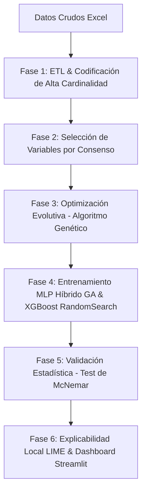

# Predicción de Personas Desaparecidas en Ecuador (2017-2025)
## Modelo Híbrido: Redes Neuronales MLP optimizadas mediante Algoritmos Genéticos

Este repositorio contiene la arquitectura de software, el pipeline de datos científico y la interfaz web interactiva para predecir la probabilidad de éxito de localización de personas reportadas como desaparecidas en el Ecuador. La fundamentación técnica y la metodología del proyecto están estructuradas bajo los estándares de publicaciones científicas de la IEEE.

---

## 🔍 Contexto del Proyecto y Justificación Científica

El dataset original consta de **75,680 registros** oficiales con **28 variables** recopiladas de la Policía Nacional de Ecuador y la Fiscalía General del Estado. El objetivo principal es predecir si una persona será:
- **Localizada con éxito (Encontrada)** (Clase 1 / Favorable)
- **No encontrada (Fallecida o con paradero desconocido/en investigación)** (Clase 0 / Desfavorable)

### ⚠️ Desafíos Críticos Resueltos:
1. **Mitigación Rigurosa de Fuga de Información (Data Leakage)**: 
   En defensas académicas, un error común es entrenar modelos con variables registradas *posteriormente* a la resolución del caso. Se eliminaron de raíz 8 variables redundantes o de fuga:
   - `fecha_localizacion`, `latitud_localizacion`, `longitud_localizacion`, `provincia_localizacion`, `dias_solucion` (sólo existen cuando ya se halló a la persona).
   - `motivo_desaparicion`, `motivacion_desaparicion_observada` (se definen en la investigación posterior).
   - `estado_desaparecido` (se correlaciona directamente con la etiqueta objetivo).
2. **Desbalanceo Severo de Clases**: 
   La clase mayoritaria (*Localizada*) representa el **~93.18%** de los datos, lo que sesgaría a un clasificador básico a predecir siempre "Encontrado". Se consolidó de forma exclusiva la técnica de **Class Weights (Pesos de Clase)** en la función de costo, descartando SMOTE (evita inventar coordenadas o datos sintéticos ruidosos) y Under-sampling (evita la pérdida masiva de 60,000 registros reales).
3. **Restricción de Ejecución Local (Pillow DLL Block)**:
   Debido a directivas locales del sistema que bloquean binarios compilados de Pillow, se diseñó una arquitectura de desacoplamiento de imports que permite que el entrenamiento evolutivo del Algoritmo Genético y la visualización sigan funcionando mediante **Plotly interactivo en memoria (renderizado en el navegador)** sin depender de Matplotlib o SHAP estático.

---

## 🛠️ Arquitectura Híbrida del Sistema

La solución integra un pipeline de Machine Learning estructurado en fases consecutivas:



### 1. ETL y Codificación Avanzada
- **Corrección Espacial**: Procesamiento de coordenadas (latitud/longitud) corrigiendo separadores decimales erróneos y outliers geográficos en el territorio ecuatoriano.
- **Codificación de Alta Cardinalidad (Target Encoding Regularizado)**: Variables geográficas de alta resolución (como cantones y circuitos) son codificadas utilizando un *Target Encoder* personalizado con suavizado (smoothing) para evitar el sobreajuste y mapear de forma eficiente variables categóricas complejas.
- **Codificación Ordinal / One-Hot Encoding**: Aplicada a características estructuradas como género, grupo étnico y rangos de edad.

### 2. Selección de Características por Consenso
Para evitar el sesgo de seleccionar variables con un único algoritmo, el módulo realiza una **votación por consenso** de 10 características a partir de 5 metodologías independientes:
- **Análisis de Multicolinealidad (Correlación de Pearson)**
- **Importancia por Permutación (Permutation Importance)**
- **Aportaciones de Shapley (SHAP Beeswarm Global)**
- **Eliminación Recursiva de Características (RFE)**
- **Información Mutua (Mutual Information)**

### 3. Sintonización Metaheurística (Algoritmo Genético)
La búsqueda manual o por grilla de hiperparámetros en redes neuronales densas (MLP) es ineficiente y no garantiza óptimos globales en espacios de alta dimensionalidad. Se implementó un **Algoritmo Genético** estructurado en **DEAP**:
- **Cromosoma**: Representa la arquitectura (capas, neuronas, activación), learning rate, tasa de dropout, batch size, optimizador y épocas.
- **Operadores**: Selección por Torneo ($k=3$), Cruce de Dos Puntos ($p_x = 0.7$), Mutación Uniforme ($p_m = 0.2$) y Elitismo del mejor individuo.
- **Función Fitness**: Maximización del **Macro F1-Score** obtenido a través de validación cruzada estratificada sobre el conjunto de entrenamiento.

### 4. Modelo de Gradient Boosting Challenger (XGBoost)
Como contraste metodológico y estándar de la industria, se entrena secuencialmente un modelo **XGBoost (Extreme Gradient Boosting)** sobre el mismo set de datos preprocesado.
- **Sintonización Tradicional:** Se optimizan sus hiperparámetros de profundidad, estimadores y tasa de aprendizaje de forma automática utilizando **RandomizedSearchCV** con validación cruzada estratificada de 3-folds.

### 5. Validación Científica y Explicabilidad (XAI)
- **Significancia Estadística (Test de McNemar)**: Determina si las diferencias predictivas entre el MLP Base, el MLP Híbrido y el XGBoost son estadísticamente significativas analizando las tablas de contingencia de aciertos y desaciertos conjuntos.
- **Interpretabilidad Local (LIME)**: Rompe el paradigma de la "caja negra" de los modelos supervisados, generando regresiones lineales locales que explican visualmente al usuario qué variables individuales (ej. edad, sexo, provincia) aumentaron o disminuyeron la probabilidad de localización en cada predicción en tiempo real.

---

## ⚖️ Estrategia de Balanceo de Clases
Por rigurosidad científica y metodológica, el proyecto utiliza de forma exclusiva la técnica de **Class Weights (Pesos de Clase)**.
* **Justificación:** A diferencia de **SMOTE**, no genera registros artificiales/ficticios que alterarían la veracidad de variables geográficas y temporales complejas. Y a diferencia de **Under-sampling**, no destruye cerca del 80% de los datos históricos del caso. Entrena sobre los 75,517 registros reales enteros aplicando mayor penalización en la función de costo a los errores de la clase minoritaria (No Localizado).

---

## 📊 Resultados de los Modelos (Conjunto de Test)

| Métrica | MLP Base (Estático) | MLP Híbrido (Optimizado por GA) | XGBoost (Challenger + RandomSearch) | Mejora Híbrido vs Base |
| :--- | :---: | :---: | :---: | :---: |
| **Accuracy (Exactitud)** | 74.89% | **76.99%** | 76.02% | **+2.81%** 🟢 |
| **F1-Score (Macro)** | 0.5792 | **0.5919** | 0.5853 | **+2.19%** 🟢 |
| **Log Loss (Pérdida)** | 0.4794 | 0.4731 | **0.4372** | **-1.31% (Reducción)** 🟢 |
| **PR-AUC (Área PR)** | 0.9881 | 0.9859 | **0.9886** | **-0.22%** 🟡 |
| **Tiempo de Entrenamiento** | 35.40 s | **6.46 s** | 15.43 s | **-81.76% (Reducción)** 🟢 |
| **Latencia de Inferencia** | 0.0386 ms | **0.0286 ms** | 0.0398 ms | **-26.03% (Reducción)** 🟢 |

- **Resultado de los Tests de McNemar**: El p-valor obtenido de **$0.00$** en la comparación MLP Base vs. Híbrido, y de **$2.67 \times 10^{-4}$** en la comparación MLP Híbrido vs. XGBoost, demuestra que las diferencias predictivas entre todos los modelos son **altamente significativas estadísticamente** (con un nivel de significancia de $\alpha = 0.05$). La sintonización evolutiva del GA sobre el MLP y la sintonización por RandomizedSearchCV en XGBoost proveen comportamientos predictivos diferenciados de alta calidad sobre el test set.

---

## 📁 Estructura del Directorio

```
Proyecto/
├── app/
│   ├── app.py                      # Enrutador principal de la app (Presentación e Inicio integrado)
│   └── pages/
│       ├── 00_Dashboard.py         # KPIs, filtros y mapa interactivo Folium (No requiere ent.)
│       ├── 01_Entrenamiento.py     # Consola de entrenamiento interactiva con logs persistentes
│       ├── 02_Prediccion.py        # Formulario de inferencia y explicador local Plotly-LIME
│       ├── 03_Comparacion.py       # Gráficos interactivos de curvas de rendimiento (ROC, PR, CM, GA)
│       └── 04_Reportes.py          # Módulo de exportación PDF/Excel/CSV
├── data/
│   └── processed/                  # Sets de datos resultantes del ETL
├── models/                         # Pesos .keras y codificadores .joblib
├── outputs/
│   ├── logs/                       # Log de ejecución persistente del pipeline
│   └── reports/                    # Reportes Excel y Artículo IEEE en Markdown
├── src/
│   ├── config.py                   # Semillas, rutas y espacio de búsqueda del GA
│   ├── etl.py                      # Limpieza, codificación y pesos de clase
│   ├── eda.py                      # Graficado automático descriptivo
│   ├── feature_engineering.py      # Filtro de variables por consenso y fallback dinámico
│   ├── model_base.py               # Entrenamiento del modelo estático con logs compactos
│   ├── model_hybrid.py             # Estructuración y corrida de DEAP con logs compactos
│   ├── model_xgboost.py            # Entrenamiento y sintonía fina de XGBoost (Challenger)
│   ├── evaluation.py               # Test de McNemar y curvas ROC/PR
│   └── interpretability.py         # Explicabilidad local y global
├── main.py                         # Orquestador del pipeline completo en consola
├── requirements.txt                # Dependencias fijadas del proyecto
├── DOCUMENTACION.md                # Apoyo teórico y metodológico para la tesis
└── README.md                       # Documentación principal
```

---

## 🚀 Instrucciones de Configuración y Ejecución

Para reproducir este proyecto, entrenar los modelos y explorar los resultados científicos, sigue detalladamente los siguientes pasos según el entorno de tu preferencia:

---

### Opción A: Instalación y Ejecución en Windows (Solo CPU)
Esta opción es ideal para un inicio rápido o si no cuentas con una tarjeta gráfica NVIDIA compatible. Cabe recalcar que TensorFlow >= 2.11 no soporta GPU de forma nativa en Windows, por lo que todo el pipeline se ejecutará en la CPU.

1. **Clonar el Repositorio:**
   ```bash
   git clone https://github.com/Ordones18/Proyecto_Metahuristicas.git
   cd Proyecto_Metahuristicas
   ```
2. **Crear y Activar un Entorno Virtual de Python:**
   ```bash
   python -m venv .venv
   .venv\Scripts\activate
   ```
3. **Instalar Dependencias:**
   ```bash
   pip install -r requirements.txt
   ```
4. **Lanzar la Aplicación Streamlit:**
   ```bash
   streamlit run app/app.py
   ```

---

### Opción B: Ejecución en WSL2 (Recomendada - Con Aceleración GPU)
Si cuentas con una GPU NVIDIA (como la RTX 5060 Ti) y deseas acelerar el entrenamiento del MLP Híbrido mediante CUDA, es necesario ejecutar el proyecto dentro de WSL2 (Windows Subsystem for Linux).

Hemos incluido un script de automatización (`run_wsl.sh`) que prepara el entorno y activa las dependencias automáticamente:

1. **Preparar WSL:** Abre tu terminal de WSL (por ejemplo, Ubuntu) e instala las librerías del sistema requeridas:
   ```bash
   sudo apt update && sudo apt install python3 python3-pip python3-venv -y
   ```

2. **Instalar el toolkit de CUDA de NVIDIA** (necesario para que `nvcc` esté disponible y para compatibilidad con GPUs modernas como la serie RTX 50xx Blackwell):
   ```bash
   sudo apt install nvidia-cuda-toolkit
   ```
   > **Nota:** Este comando instala las herramientas de compilación CUDA a nivel de sistema. Las librerías de runtime (cuDNN, cuBLAS, etc.) que TensorFlow usa en tiempo de ejecución las gestiona automáticamente `tensorflow[and-cuda]` vía pip — no es necesario instalarlas manualmente.

3. **Dar permisos y ejecutar el instalador:**
   ```bash
   chmod +x run_wsl.sh
   ./run_wsl.sh
   ```
   *El script creará un entorno virtual aislado (`.venv_wsl`), instalará `xgboost`, `tensorflow` con soporte CUDA, configurará automáticamente las rutas de librerías GPU desde los paquetes `nvidia-*` de pip, verificará la detección de tu GPU y te ofrecerá un menú interactivo para arrancar el pipeline o levantar Streamlit.*

4. **Ejecución Manual en WSL:** Si prefieres arrancar Streamlit manualmente en el futuro sin utilizar el script interactivo, recuerda exportar las rutas de drivers de la GPU para que TensorFlow la reconozca:
   ```bash
   source .venv_wsl/bin/activate

   # Configurar LD_LIBRARY_PATH con las libs CUDA de pip
   export LD_LIBRARY_PATH=$(python3 -c "
   import site, os
   sp = site.getsitepackages()[0]
   d = os.path.join(sp, 'nvidia')
   paths = [os.path.join(d, p, 'lib') for p in os.listdir(d) if os.path.isdir(os.path.join(d, p, 'lib'))]
   print(':'.join(paths))
   "):/usr/lib/wsl/lib:$LD_LIBRARY_PATH

   streamlit run app/app.py
   ```

---

### Opción C: Ejecución en Linux nativo con GPU AMD (ROCm)

Si cuentas con una GPU AMD (como la RX 6000/7000 series o Instinct), TensorFlow puede aprovecharla mediante **ROCm** (Radeon Open Compute), el equivalente de AMD a CUDA.

> ⚠️ **Importante:** ROCm solo funciona en **Linux nativo**. El soporte en WSL2 para AMD es experimental y no está garantizado. Se recomienda Ubuntu 22.04 o superior.

#### GPUs AMD compatibles con ROCm
Las principales GPUs de consumo soportadas son: RX Vega 56/64, Radeon VII, RX 5700 XT, RX 6600/6700/6800/6900 XT y RX 7700/7800/7900 XT. Puedes consultar la lista completa en la [documentación oficial de ROCm](https://rocm.docs.amd.com/projects/install-on-linux/en/latest/reference/system-requirements.html).

#### 1. Instalar ROCm

```bash
# Agregar repositorio oficial de AMD ROCm
sudo apt update
wget https://repo.radeon.com/amdgpu-install/6.1/ubuntu/jammy/amdgpu-install_6.1.60101-1_all.deb
sudo dpkg -i amdgpu-install_6.1.60101-1_all.deb
sudo apt update

# Instalar ROCm y sus dependencias
sudo amdgpu-install --usecase=rocm

# Agregar tu usuario al grupo render y video
sudo usermod -aG render,video $LOGNAME

# Reiniciar sesión o reboot para aplicar los grupos
```

#### 2. Verificar que ROCm detecta la GPU

```bash
rocm-smi
# Deberías ver tu GPU AMD listada con temperatura y uso
```

#### 3. Instalar TensorFlow con soporte ROCm

AMD mantiene un fork oficial de TensorFlow con soporte ROCm (en lugar de `tensorflow[and-cuda]`):

```bash
source .venv_wsl/bin/activate

# Instalar tensorflow-rocm (compatible con ROCm 6.x)
pip install tensorflow-rocm
```

> **Nota:** `tensorflow-rocm` y `tensorflow[and-cuda]` **no son compatibles** entre sí. No instales ambos en el mismo entorno virtual.

#### 4. Verificar detección de GPU AMD

```bash
python3 -c "
import tensorflow as tf
gpus = tf.config.list_physical_devices('GPU')
print('TF version:', tf.__version__)
print('GPUs (ROCm):', gpus)
"
```

#### Comparativa rápida: NVIDIA vs AMD

| Aspecto | NVIDIA (CUDA) | AMD (ROCm) |
|---|---|---|
| **Ecosistema** | Maduro, amplio soporte | Más reciente, en crecimiento |
| **TensorFlow** | `tensorflow[and-cuda]` (oficial) | `tensorflow-rocm` (AMD fork) |
| **WSL2** | ✅ Soporte completo | ⚠️ Experimental / limitado |
| **Linux nativo** | ✅ | ✅ |
| **Compatibilidad de GPUs** | Muy amplia | Solo GPUs seleccionadas |


Una vez abierta la aplicación en tu navegador web:
1. **Entrenar el Pipeline:** Ve al menú lateral en **"Entrenamiento"** y haz clic en **"Iniciar Pipeline Completo de Entrenamiento"**. El sistema ejecutará secuencialmente:
   * **ETL:** Carga y limpia los datos, aplicando target encoding y estructurando los pesos de clase.
   * **EDA:** Genera reportes visuales descriptivos interactivos.
   * **Selección por Consenso:** Reduce las variables a las 10 mejores.
   * **Modelado:** Entrena el MLP Base, optimiza el MLP Híbrido mediante el Algoritmo Genético, y sintoniza el **XGBoost** mediante `RandomizedSearchCV`.
   * **Evaluación & XAI:** Corre el Test de McNemar y prepara las explicaciones locales de LIME.
2. **Explorar el Dashboard:** Revisa mapas de calor geográficos y KPIs demográficos calculados dinámicamente.
3. **Realice Predicciones:** Ingresa casos de prueba individuales para estimar el riesgo de localización en tiempo real y obtener explicaciones LIME interactivas eligiendo cualquiera de los 3 modelos.
4. **Comparar:** Analiza curvas ROC, Precision-Recall y matrices de confusión interactivas en la sección de **Comparación**.
